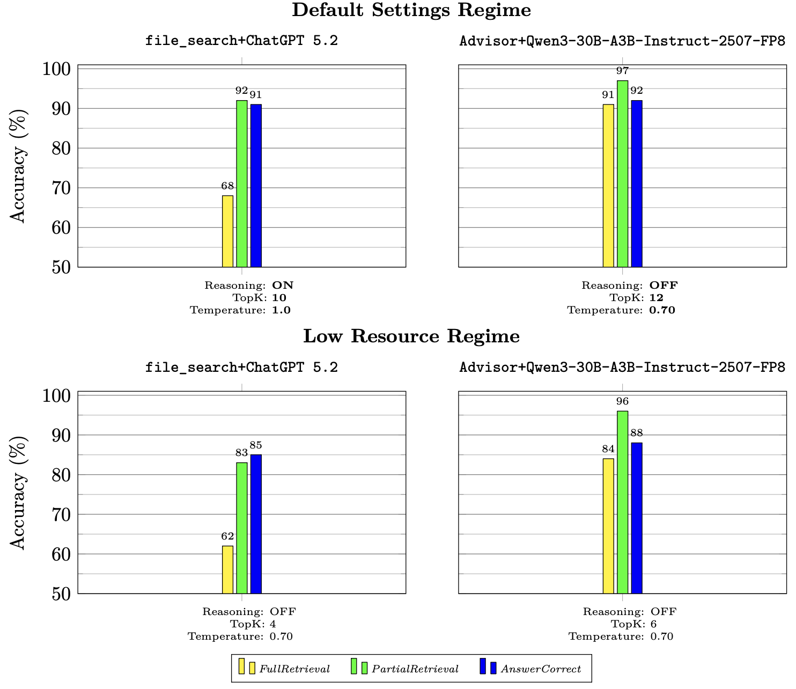

## Support-100: A Real-World Multi-Document, Single-Turn, Technical QA Benchmark: Probing a Retrieval-Inference Trade-Off

In this working paper, we present Support-100, a real-world enterprise multi-document,
single-turn, technical QA dataset designed to support simultaneous evaluation of retrieval and
RAG QA accuracies. Support-100 consists of 100 characteristic technical customer support
questions curated by senior support engineers, coupled with gold-standard answers (validated
historical engineering responses) grounded in gold-standard documents (validated articles and
documentation containing information sufficient to answer the corresponding questions) and
mixed with distractors from WixQA. Using this benchmark, we evaluated two RAG QA sys-
tems: a 3B-active sparse edge model ca. Jul. 2025 (Qwen3-30B-A3B-Instruct-2507-FP8) paired
with the ScienceLogic Skylar Advisor retrieval system, Advisor, and a modern frontier model
ca. Dec. 2025 (ChatGPT 5.2) paired with the OpenAI API retrieval system. file_search.
Both systems were tested on the same questions with the same prompt template and pro-
vided with the same Support-100 corpus. Responses were each evaluated using three binary
pass/fail rubrics: FullRetrieval, PartialRetrieval, and AnswerCorrect. In the default settings
regime, Advisor attained (91%/97%) (full/partial) accuracies compared to (68%/92%) for
file_search, with the resulting Qwen3-30B-A3B-Instruct-2507-FP8 QA accuracy at 92%,
topping ChatGPT 5.2 at 91%. In a low resource regime meant to simulate the same systems
configured as they might be at the edge without reasoning and with lower TopK, Advisor
attained (84%/96%) (full/partial) accuracies compared to (62%/83%) for file_search, with
the resulting Qwen3-30B-A3B-Instruct-2507-FP8 QA accuracy at 88%, topping ChatGPT 5.2
at 85%. These results indicate that the accuracy of a RAG QA system using a small edge model
can match or beat the accuracy of a RAG QA system using a modern frontier model given a
sufficiently more accurate retrieval system.

### The Paper

See [support100.pdf](support100.pdf).

### The QA Dataset

`QA.csv` contains, for each of 100 questions, the gold-standard answer and the relevant gold-standard documents to derive the answer. It is in `CSV` format.

`QA.jsonl` contains a `JSONL` representation of the same.

### The Corpus

The `support100_corpus/` directory contains the document corpus for a retrieval-based QA evaluation benchmark built on ScienceLogic technical support content. It contains 402 PDF documents and 209 text files organized into three sub-collections.

The `wixQA/txt_files/` directory contains 209 text files from the WixQA benchmark, a publicly available enterprise RAG benchmark grounded in Wix customer support content. These documents were included as additional distractors due to their semantic similarity to the ScienceLogic corpus.

The `gold_standard_documents/` directory contains 95 PDF documents that are the gold-standard source documents. These are the documents from which the correct answers to the support100 questions were derived.

The `context_documents/` directory contains 307 PDF documents that are semantically related to the gold-standard documents but are not the definitive answer sources. These serve as distractors to challenge retrieval systems, but can also be helpful to the model in understanding content.

